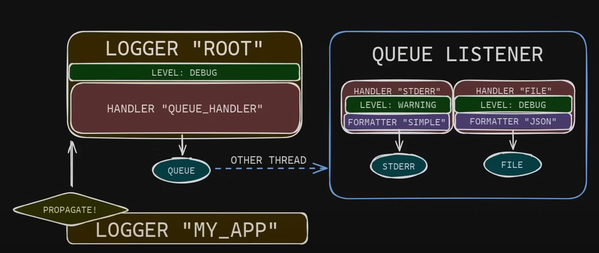

# ml_helper

ml_helper - Machine Learning Helper Functions
Welcome to ml_helper - a collection of utility functions that I found useful during my
work in machine learning projects. These functions are designed to simplify common tasks 
and enhance productivity in your machine learning workflows.

Feel free to contribute to ml_helper by submitting pull requests or suggesting
new features. Your feedback is valuable in making this collection more robust and 
helpful for the machine learning community.

Happy coding! 🚀

## To-Do

- [ ] Add third party logging. Stuff like cv is still excluded when verbose=3
- [ ] Add code for pd.DataFrames
  - [ ] Add code for column datastats(min, max, std, nunique, etc)
- [ ] Maybe think of class Strucure. Benefting here?
- [ ] Is there an auto doc generator, similiar to the one in java generating an HTTPS doc?
- [ ] Implement the following, since QueueHandler somehow cant parse get handlers: in config. Did [he](https://www.youtube.com/watch?v=9L77QExPmI0) used a different Version? how?
  - 
- [ ] Make the Contents tree prettier...
## Contents

|--- configs\
|   |--- logging_config.json\
|--- src\
|   |--- config.py\
|   |--- log.txt\
|   |--- logging_helper.py\
|   |--- test_main.py\
|   |--- utils.py\
|--- test_data\
|   |--- testdata.csv\
|--- .gitignore\
|--- README.md\
|--- log.txt\

.

